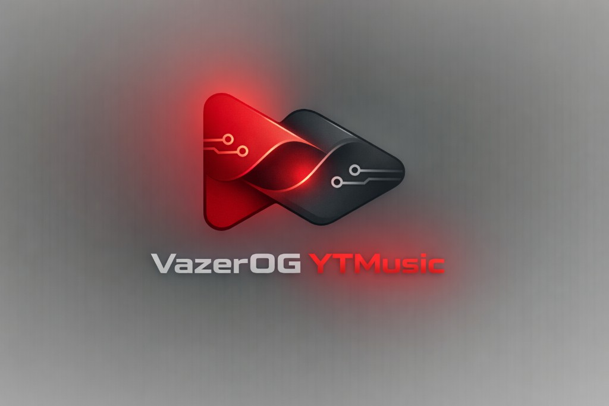

<p align="center">
  
</p>

<h1 align="center">VazerOG YTMusic</h1>

<p align="center">
  Custom <a href="https://morphe.software">Morphe</a> patches for YouTube Music, adding true dual-player crossfade between tracks.
</p>

## Features

- **True crossfade** — Creates a second ExoPlayer instance via YTM's internal factory, crossfades with a configurable volume curve, then releases the old player. No silence gap.
- **Configurable duration** — 1–12 seconds or 500–30000ms in advanced mode.
- **Fade curve selection** — Equal Power (default), Ease Out Cubic, Ease Out Quad, or Smoothstep.
- **Works on skip and auto-advance** — Crossfade triggers on manual next/previous and on natural track endings. Each can be independently enabled/disabled.
- **Auto-advance via `playNextInQueue`** — The monitor routes through YTM's actual queue advancement pipeline (`mo15738y` → `m15968e`), not `stopVideo` which is teardown-only.
- **Session control** — Long-press the shuffle button to pause/resume crossfade for the current session, with configurable press duration and haptic feedback.
- **Video mode handling** — Blocks switching to video mode while crossfade is active (audio-only requirement). Switching from video back to audio is always allowed.
- **VazerOG settings UI** — Dedicated settings page with fade curve, duration, session control, and credit sections.

## Compatibility

| App | Version |
|-----|---------|
| YouTube Music | 8.44.54 |

## Download

Get the latest patch bundle from [GitHub Releases](https://github.com/VazerOG/VazerOG-YTMusic/releases).

| File | Description |
|------|-------------|
| `patches-x.x.x.mpp` | Morphe patch bundle (use with Morphe app or CLI) |

## How to use

### Add to Morphe (recommended)

Click here to add these patches to Morphe:

[**Add VazerOG patches to Morphe**](https://morphe.software/add-source?github=VazerOG/VazerOG-YTMusic)

Or manually add this repository URL as a patch source in Morphe:

```
https://github.com/VazerOG/VazerOG-YTMusic
```

### Apply with Morphe CLI

```bash
java -jar morphe-cli.jar patch \
  --patches patches-1.0.0.mpp \
  youtube-music-8.44.54.apk
```

### Build from source

Prerequisites: JDK 17, Android SDK

```bash
git clone https://github.com/VazerOG/VazerOG-YTMusic.git
cd VazerOG-YTMusic
./gradlew :patches:buildAndroid
```

The `.mpp` patch bundle (with `classes.dex` for Android) will be at `patches/build/libs/patches-*.mpp`.

## License

Licensed under the [GNU General Public License v3.0](LICENSE).

This project uses the Morphe Patches template and is compatible with Morphe. It is not authored by or affiliated with the Morphe project.
